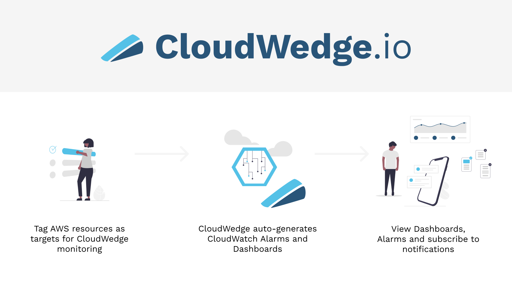

<p align="center">
  
</p>

<p align="center">
    <em>CloudWedge is an AWS Cloudwatch monitoring framework that accelerates your ability to get up and running with native AWS monitoring services.</em>
</p>


# CloudWedge

<p align="center" style="margin-top: 2rem; margin-bottom: 4rem;"><strong>View Documentation</strong>: <a href="https://cloudwedge.io" target="_blank">https://cloudwedge.io</a>
</p>


## Roadmap Ideas

- Add more AWS services (`app/src/cloudwedge/services`)
- Add multi account and multi region dashboard views
- Review permissions
- Provide custom dashboard that is deployed into local dns
- Streamline performance, maybe a way to minimally track state

## Project structure

```bash
|-- app
|   |-- cloudwedge-spoke.yaml                 # Spoke template, deloyed from stackset resource in cloudwedge.yaml file
|   |-- cloudwedge.yaml                       # Core template. This is the magic.
|   |-- resources                             # Step function json configurations
|   `-- src                                   # CloudWedge lambda functions and logc
|-- package.json                              # Standard use, look here for all the scripts you can run
|-- publishing
|   |-- media                                 # Various images and media assests used in the app, published to s3
|   |-- publishing.yaml                       # Template file to setup some of the resources needed to provide this to the public
|   `-- scripts                               # Bash scripts for publishing the application
|-- docs/                                     # Markdown files for the retype page, published to Github pages
`-- retype.yml                                # Configurations for making the documentation page
```

## Developing

The application is orchestrated with a step function, so to run it locally requires providing the inputs to each lambda function. The `/app/src` folder has each function, and its `input.json` file. That can be used for simulating the input it would receive from the step function. You can progress through the functions locally by taking the output of one, and then putting it in the input of the next. Review the step functions to understand the flow between the input and outputs.

### Run a lambda locally

Check out the package.json file for running the functions. You can see the AWS SAM resource listed under the script. Such as

`npm run local:get` runs the lambda resource defined in the `cloudwedge.yaml` file called `GetResourcesFunction`

### Debug locally

You can use the built in vscode debugger to get the step through debugging experience.

- Drop this in the code

  ```python
  # 🐛🐛🐛 #
  import debugpy; debugpy.listen(('0.0.0.0', 5858)); debugpy.wait_for_client(); debugpy.breakpoint()
  # 🐛🐛🐛 #
  ```

- run the function via the npm scripts

  ```bash
  npm run local:get
  ```

- Active the vscode debug file for the given function. Check out the `.vscode/launch.json` for configuration details.

## &#x1F4DA; Developer Reference

#### Misc

- [Microsoft Teams card](https://docs.microsoft.com/en-us/outlook/actionable-messages/message-card-reference)

#### AWS

- [YAML references](https://github.com/dwbelliston/cloudwedge/blob/bdd5864d72f2d25ca90a4d8b39a94c352a1df089/orig/stacks/hub.yaml)
- [Step Function Iam for Sub Workflows](https://docs.aws.amazon.com/step-functions/latest/dg/stepfunctions-iam.html)
- [Using Sub Workflows](https://docs.aws.amazon.com/step-functions/latest/dg/connect-stepfunctions.html)
- [More Sub Workflows](https://docs.aws.amazon.com/step-functions/latest/dg/sample-start-workflow.html)
- [Content Filtering with event patterns](https://docs.aws.amazon.com/eventbridge/latest/userguide/content-filtering-with-event-patterns.html)
- [Step Function Context Object](https://docs.aws.amazon.com/step-functions/latest/dg/input-output-contextobject.html)
- [CloudWatch Insights Docs](https://docs.aws.amazon.com/AmazonCloudWatch/latest/logs/AnalyzingLogData.html)
- [EventBridge Sample Events](https://docs.aws.amazon.com/eventbridge/latest/userguide/event-types.html)
- [Cloudwatch Metric Math](https://docs.aws.amazon.com/AmazonCloudWatch/latest/monitoring/using-metric-math.html)
- [Cloudwatch Alarm Yaml example](https://docs.aws.amazon.com/AWSCloudFormation/latest/UserGuide/aws-properties-cw-alarm.html)
- [Kinesis Monitoring Best Practices](https://docs.aws.amazon.com/firehose/latest/dev/monitoring-with-cloudwatch-metrics.html#firehose-cloudwatch-metrics-best-practices)
- [AWS Icons for Notification Cards](https://aws.amazon.com/architecture/icons/)
- [Monitoring Best Practices](https://cloud.netapp.com/blog/aws-blg-aws-monitoring-tools-and-best-practices-monitor-what-matters#H_H5)
- [Monitoring Best Practices](https://www.infoq.com/news/2020/10/aws-dashboards/)
- [EventBridge cross accounts](https://docs.aws.amazon.com/eventbridge/latest/userguide/eventbridge-cross-account-event-delivery.html)
- [IAM Bucket Policy](https://aws.amazon.com/blogs/security/control-access-to-aws-resources-by-using-the-aws-organization-of-iam-principals/)
- [IAM PrincipalOrgId](https://docs.aws.amazon.com/IAM/latest/UserGuide/reference_policies_condition-keys.html#condition-keys-principalorgid)

#### Docs
- [Retype docs](https://retype.com/)

<hr>
<hr>

<div align="center">
 &#x1F9C3; 0% Fruit Juice || &#x1F35E; Gluten Free || &#x1F1FA;&#x1F1F8; Made In America
</div>
