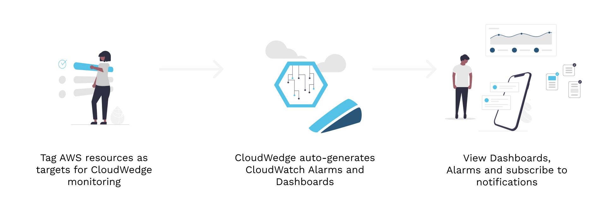

# Welcome to CloudWedge

CloudWedge is an AWS Cloudwatch monitoring framework that accelerates your ability to get up and running with native AWS monitoring services.



---

[!embed](https://youtu.be/qXGSXMSRjLc)

---

## Features

CloudWedge is perfect for when you want to use the native AWS monitoring services, but you dont want to fuss with the all the implementation details. CloudWedge will provide the monitoring alarms and the dashboards you would have built by hand (or in CloudFormation) and give you back that time to focus on what really matters.

Essentially, CloudWedge is doing the "undifferentiated heavy lifting" of setting up CloudWatch and and wiring it into an alerting pipeline using SNS.

#### :cloud: Native AWS

CloudWedge is using 100% AWS native services from the cradle to the grave.

#### :closed_lock_with_key: 100% Privacy

Your data never leaves your account. No 3rd party to ship data to, its all contained within the walls of your own home. Look at the source code yourself, we are not hiding anything. You have total control.

#### :white_check_mark: Easy install

[Installation](guides/getting-started.md) takes only a minute. Them you only have to learn the custom CloudWedge "tags" and add them to your resources.


#### :raising_hand: Opt-In Only

You choose what to monitoring and how. Decided the resources you want supported from the available AWS [services](services/index.md).

#### :boom: Event Driven

 You change your environment, CloudWedge will update itself. Its not as sophisticated as true AI, but you might start to think so.


!!!warning CloudWedge is not

- A competitor to more robust, but more expensive 💲💲💲, Application Performance Monitoring tools like DataDog, New Relic, Dynatrace, App Dynamcis etc..
- A fully customizable enterprise suite of monitoring tools with beautiful dashboard visualizations and stand-alone app support for all of your devices.
- An infinitely scalable monitoring tool.

!!!

!!!success CloudWedge is

- Better than nothing.
- A tool to automate away the complexity of setting up CloudWatch Alarms and Dashboards and facilitate alert notifications when those CloudWatch Alarms are breached.
- An inexpensive, easy to deploy, set of native AWS tools/services to get you up and running with monitoring and alerting on AWS.
- Easy to use — Just add tags!
- Extensible.
- Multi-account/Multi-region. *(Coming soon)*

!!!

---


## How CloudWedge works

Getting a little more technical, here is a breakdown of the interactions between you, AWS and CloudWedge:

| Actor | Activity                                                                                                                                                          |
| :---: | ----------------------------------------------------------------------------------------------------------------------------------------------------------------- |
|  :female-technologist:   | You tag a resource with a CloudWedge supported tag                                                                                                                |
|  :cloud:   | AWS captures user activity in AWS EventBridge                                                                                                                      |
|  :robot_face:   | CloudWedge watches AWS EventBridge for any relevant events. In this case, it sees a CloudWedge tag was added so it decides it needs to work.                     |
|  :robot_face:   | CloudWedge starts an AWS StepFunction which orchestrates the CloudWedge activity                                                                                  |
|  :robot_face:   | CloudWedge uses the AWS apis to get all the resources in your account that have opted-in to be monitoring be CloudWedge.                                          |
|  :robot_face:   | CloudWedge iterates over those resources and builds a CloudFormation template which has all the AWS CloudWatch alarms and dashboards created for those resources. |
|  :robot_face:   | CloudWedge uses the AWS CloudFormation api to deploy the CloudFormation template, which does all the creation of the alarms and dashboards.                       |
|  :cloud:   | AWS sends you a bill                                                                                                                                              |
|  :female-technologist:   | You do more important things                                                                                                                                      |

---

## Example Usage

You can get started monitoring with CloudWedge by using the following CloudWedge core tags. Just slap a tag called [!badge variant="primary" icon="tag" iconAlign="left" text="cloudwedge:active"] on a supported service and watch the alarms get created. These are the core configuration tags:


==- [!badge variant="primary" icon="tag" iconAlign="left" text="cloudwedge:active"]

##### Tag Name

```
cloudwedge:active
```

##### Tag Details

|         |                 |
| :------------ | :--------------------------|
| **Required**    | :icon-verified: |
| **Description** | This tag controls if the resource should be included as candidate for alarms. Without this tag the cloudwedge will not identify this resource as in scope. |
| **Default**     | No default, its either on or off |
| **Values**      | Only the value "true" will mark the resource as in scope for alarms. Any other value will not considered. |
| **Example**     | `true` |

==- [!badge variant="primary" icon="tag" iconAlign="left" text="cloudwedge:owner"]

##### Tag Name

```text
cloudwedge:owner
```

##### Tag Details

|         |                 |
| :------------ | :--------------------------|
| **Required**    | :icon-x-circle: |
| **Description** | Tag determines what owner the alerts will be marked with. You can use this owner to filter alerting methods to specifc owners. For example, you may want to receive a text just for systems you own. |
| **Default**     | `cloudwedge` |
| **Values**      | any string |
| **Example**     | `customers-microservice` |

==- [!badge variant="primary" icon="tag" iconAlign="left" text="cloudwedge:level"]

##### Tag Name

```text
cloudwedge:level
```

##### Tag Details

|         |                 |
| :------------ | :--------------------------|
| **Required**    | :icon-x-circle: |
| **Description** | Tag determines what level the alerts will be marked as. You can use this level to filter alerting methods to specifc levels. For example, you may want to receive a text just for critical alerts. |
| **Default**     | `medium` |
| **Values**      | `critical` `high` `medium` `low` |
| **Example**     | `critical` |
===

---

## Deployment

CloudWedge is packaged in a CloudFormation template. This makes is very easy to deploy. You just need to get a url reference to the pre-baked CloudFormation and then use the AWS CloudFormation console to deploy the stack into your account.

---

## Getting Started

It's always nice to have someone show you around a new place. Check out the [Getting Started](./guides/getting-started.md) guide to get comfortable using CloudWedge.

---

## License

This project is licensed under the terms of the MIT license.

!!! :zap: Let us know what you think!

Send us some a message in the chat bubble below or join the discussion on github.
!!!