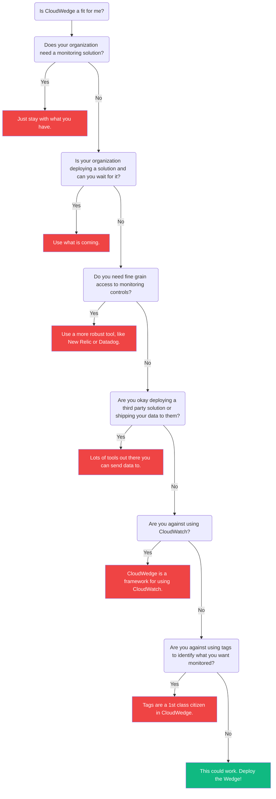

# Frequently Asked Questions

## Should I use CloudWedge?

Here are a few questions to get a feel for what you should do.

---

## What does CloudWedge cost?

We havent found a way to charge yet. So.. I guess its free. :money_with_wings:
The only cost to you will be your AWS bill to have CloudWatch alarms and dashboards.

---

## Can you help me set it up?

For sure. Send us a message in the chat bubble below or an email at help@cloudwedge.io and we will be happy to help.