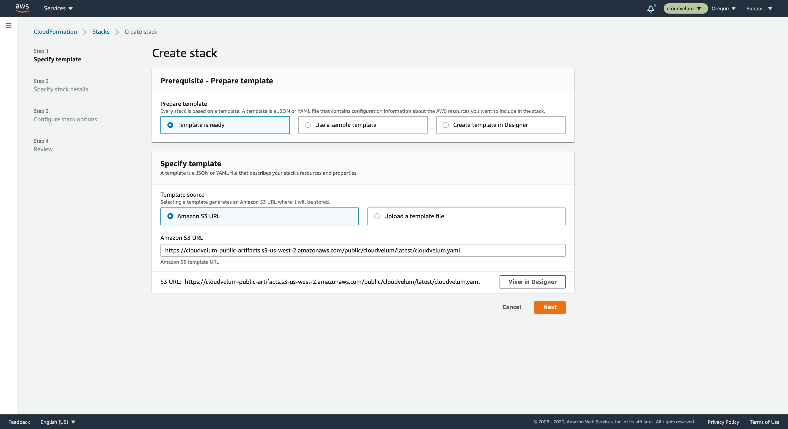
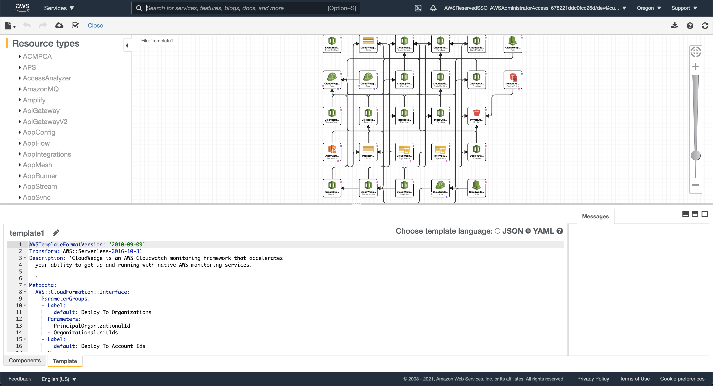
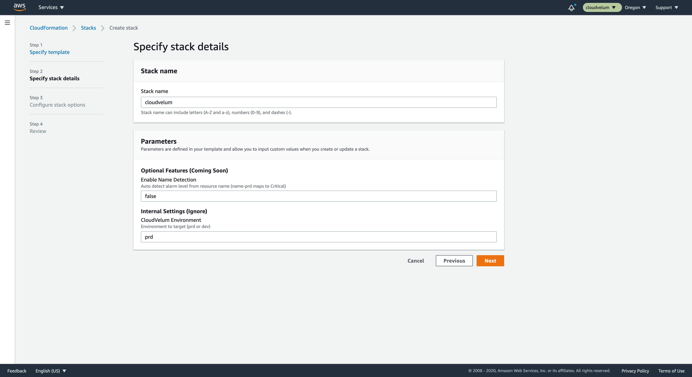
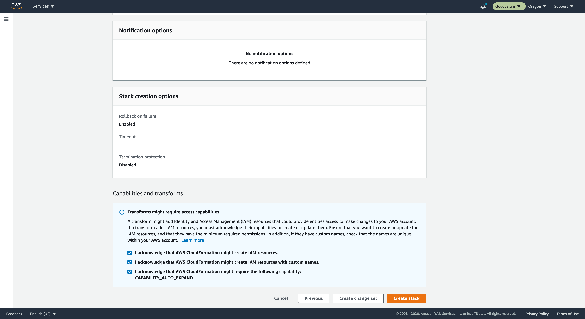
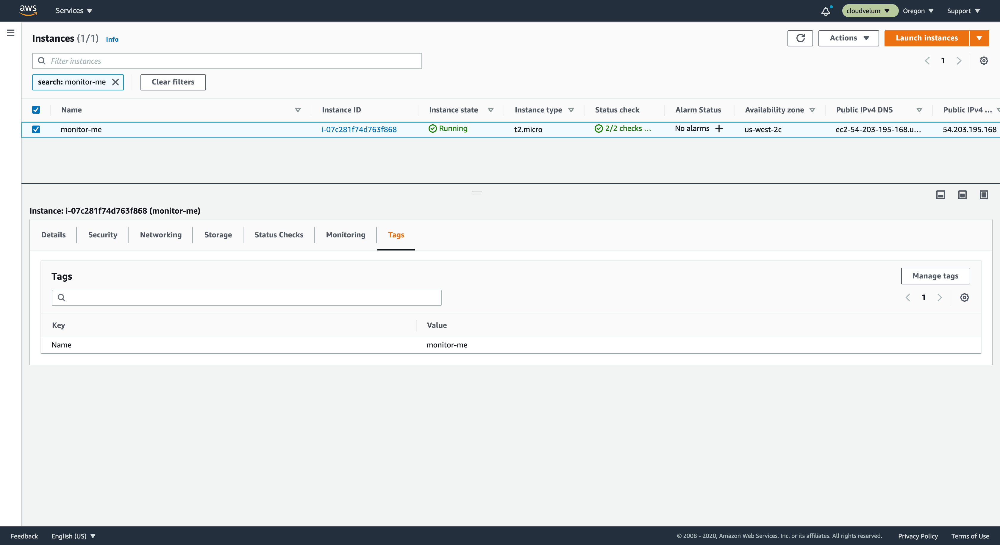
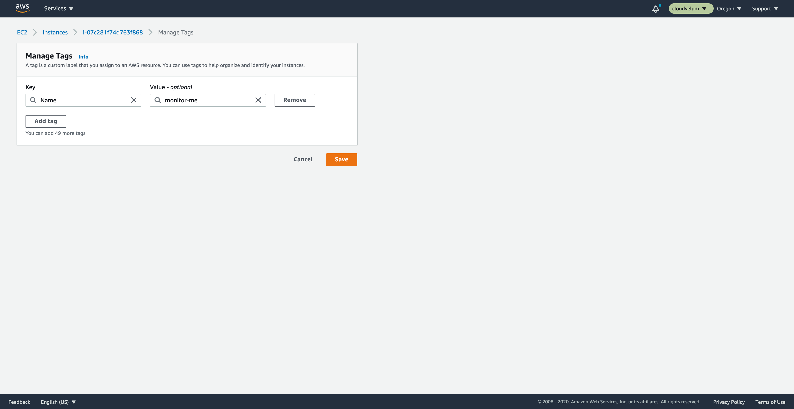
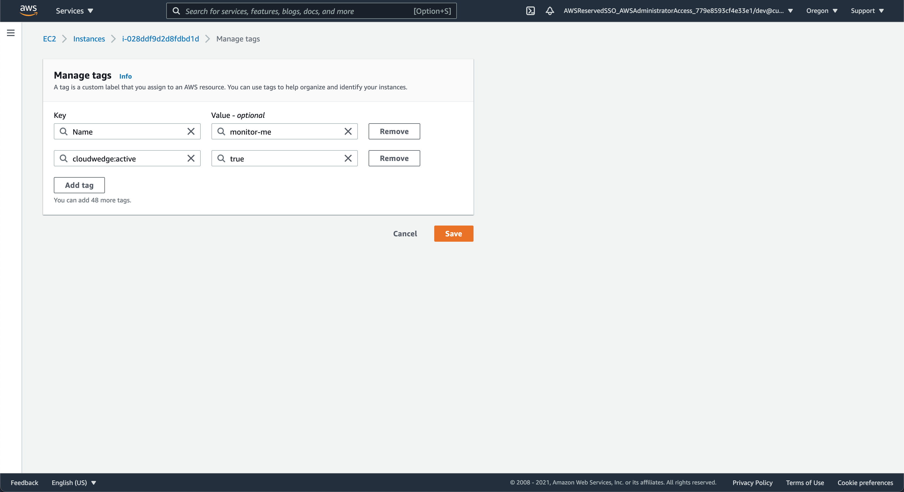
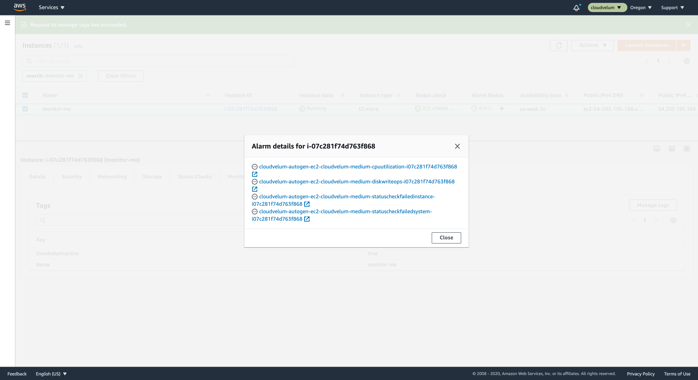

## Intro

This tutorial will walk you through deploying CloudWedge to your AWS environment and then bring you up to speed on how to interact with it to get your first CloudWatch Alarms and CloudWatch Dashboards created.

When you are ready to jump into more detail and see all the ways you can customize and tweak CloudWedge to get the most out of it, you can come back and check out the doc pages. For now, this tutorial is going to focus on the most basic implementation of CloudWedge.

## For Starters

A few things to know before we get started.

At this time, CloudWedge is deployed to a single AWS account and to a single AWS Region. We would suggest choosing a sandbox or dev account for your first test ride and then when you are comfortable, move up to bigger and better accounts.

## To Deploy

Deployment is simple. CloudWedge is packaged into an AWS CloudFormation template. This CloudFormation template is stored in a public location so anyone can read the template and use it to create a CloudFormation stack from it.

==- :icon-info: Public? I thought you said this was private...

Just want to be extra clear here, the template is public, but when you use the template to create the resources in your account, the resources are 100% private. The template is only a blueprint to tell CloudFormation what to deploy into your account.

To make it easy to deploy, we have created the link to deploy this to CloudFormation already.

Here is the full link, you can copy and past this into your browser.

```
https://us-west-2.console.aws.amazon.com/cloudformation/home?region=us-west-2#/stacks/create/template?stackName=cloudwedge&templateURL=https://cloudwedge-public-artifacts.s3-us-west-2.amazonaws.com/public/cloudwedge/latest/cloudwedge.yaml
```

Notice that the link is specific to the `us-west-2` region. You can change out the region identifier to any of the regions you would like.

==- :icon-info: CloudFormation link anatomy

The link is composed of a few different pieces.

The base url is the link to the 'create' wizard in the CloudFormation console. It looks like:

```
https://us-west-2.console.aws.amazon.com/cloudformation/home?region=us-west-2#/stacks/create/template
```

Adding to the base url, we are going to identify the stack template we want to create and the name of the stack to use

```
?stackName=cloudwedge
&templateURL=https://cloudwedge-public-artifacts.s3-us-west-2.amazonaws.com/public/cloudwedge/latest/cloudwedge.yaml
```

Putting these together we tell CloudFormation to create a stack called `cloudwedge` using the template located at `https://cloudwedge-public-artifacts.s3-us-west-2.amazonaws.com/public/...`

You will also note that the base url is set to the `us-west-2 (Oregon)` AWS region. You can change that to target the region you want to deploy to.
===

[!button variant="info" size="l" icon=":rocket:" iconAlign="right" text="Deploy to Oregon" target="blank"](https://retype.com/)

[!button variant="info" size="l" icon=":rocket:" iconAlign="right" text="Deploy to N Virginia" target="blank"](https://retype.com/)

[!button variant="info" size="l" icon=":rocket:" iconAlign="right" text="Deploy to Ohio" target="blank"](https://retype.com/)


Once you clicked the link to deploy from above, you will now be in the AWS console.

### Create Stack Page



You can see that the template url is filled in from the url param that we have provided. You can click on that box on the lower right that says 'Designer' to get a glimpse at what is going to be created.

### Designer View



Here you can see an overview of all the resources being created and also a full view of the CloudFormation template itself.

### Parameters



Parameters can be left alone, in future versions we may have some configuration options here, but for now just continue. If you really want, you can change the stack name.

### Stack Options

There are several stack options that you can review, if you want to change some of the settings you can, but likely you can leave these with the defaults. Note that you can tag this stack, maybe you have some company policy that requires tagging, now is the time to do that.

### Review and Create



Review the details of the create. At the bottom, you will see some ackowledgments about IAM capabilities.

!!! IAM Capabilities

Basically, this is a warning from CloudFormation saying that this stack is going to be creating IAM roles and policies. Read more about it on AWS docs for [IAM Capabilities](https://docs.aws.amazon.com/serverlessrepo/latest/devguide/acknowledging-application-capabilities.html).

!!!

The stack will create IAM permissions to allow the application to work. Resources like Lambda and Step functions will require access to read data in the AWS account and the real big part of the app is it will be creating CloudFormation stacks that have the CloudWatch Alarms and Dashboards. Just review the template to see everything its going to do, and when you are good with it, create the stack.

You can review the progress in the CloudFormation console.

### Review the Deploy

Once the stack is completed you can see all the resources it created. Take a minute to poke around and see what makes up the CloudWedge application.

A couple of the main resources that have been created are:

| Resource _Type_                                                     | Purpose                                                                                                                                                                                                         |
| :---------------------------------------------------------------- | --------------------------------------------------------------------------------------------------------------------------------------------------------------------------------------------------------------- |
| CloudWedgeTagEventRule _AWS::Events::Rule_                       | This EventBridge rule is going to captures changes to tags on your resources that have the prefix `cloudwedge:` this is how CloudWedge will react, since it is event driven.                                    |
| CloudWedgeBuilderStateMachine _AWS::StepFunctions::StateMachine_ | This step function does all the work. It orchestrates several lambda functions to gather resource information and build alarms and dashboards for the resources that have opt-in to be monitored by CloudWedge. |
| CloudWedgeAlertsTopic _AWS::SNS::Topic_                          | When an alarm is breached, this is the topic gets published to. This is where users subsribe to start receiving alerts.                                                                                         |

!!!light :diving_mask: Dive Deeper
When you are ready to dive deeper into the CloudWedge resources, review the more advanced documentation.
!!!

## To Monitor

We are ready now to monitor something with CloudWedge. Lets start with the basic EC2 instance.

Navigate to the EC2 console and review your instances. Select the instance you want to monitor. In the table you can see if any alarms have been created for this instance already. Review the column called `Alarm Status` to see if any alarms are created.

When you selected the instance, you should see a panel now at the bottom with details for the instance.

### View your instance



Click on the `Tags` section on the panel. Click on `Manage Tags`.



### Add CloudWedge opt-in tag

Lets add the CloudWedge opt-in tag on this instance.

- Tag key

```
cloudwedge:active
```

- Tag value

```
true
```

Save this new tag on the instance.



### Review alarms

After a short wait, you can now see on the instance view that the column called `Alarm Status` now has alarms listed. If you click on the circle with the ellipsis it will open a viewer to see the name of the alarms. These are the default alarms created by CloudWedge.



!!! Defaults

CloudWedge tries to get really good defaults so you dont have to do any tweaks. But, there are always those apps that need something different. In those cases, you can control which alarms get created and the properties that go into alarm creation.

This is all covered in the documentation.
!!!

### Add owner

Lets add one more tag, the owner tag. This tag is important, it basically allows you to group resources across AWS services that apply to a single team, app, or domain or whatever logical grouping might be meaningful to you.

Go back and edit this instances tags, adding to it one more tag. The owner value can be something different, but we are going to mark this in the example as the mango.

- Tag key

```
cloudwedge:owner
```

- Tag value

```
mango
```

This owner is now going to be preserved when alarms are triggered so the alarm can be owner aware. This gives us the ability to only receive alerts for the resources that are relevant to us.

## To Subscribe

Now that alarms are created, we need to subscribe to an AWS SNS Topic to receive alerts when the alarms go off.

Go to the SNS service in the AWS Console and find a topic called `cloudwedge-alerts-topic`.

Click the subscribe button to add your new subscription. You can choose delivery as email or sms.

As part of the subscription you can add a filter policy, this is where we can identify that we only want to see events for our particular owner(s). Here is an example policy for filtering to just alerts that are for the `mango` owner.

```json
{
  "owner": ["mango"]
}
```

You can edit the policy later, so as your app changes so can your notifications.

!!!success :tada: You did it!

At this point, you have set yourself up with CloudWedge. You can now just tag any of the resources for a supported CloudWedge resource and get alarms created for it. All alerts with funnel through this topic, so you dont have to worry about setting that up again.
!!!

Save the subscription and wait for your first alert from CloudWedge!
