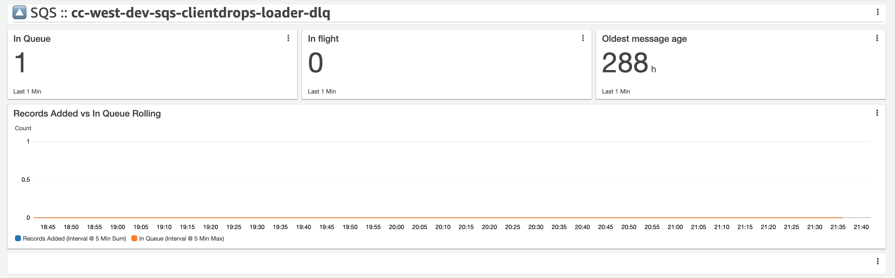

# Step Functions

[!badge icon="check-circle" text="Stable" variant="success"]

## CloudWatch Configuration

When a resource is monitored it is going to be using these CloudWatch configurations to identify the metric.

| `namespace` | `dimension`     | `metrics`                                                                                                      |
| ----------- | --------------- | -------------------------------------------------------------------------------------------------------------- |
| AWS/States  | StateMachineArn | [Available CloudWatch Metrics](https://docs.aws.amazon.com/step-functions/latest/dg/procedure-cw-metrics.html) |

## Service Defaults

When an alarm is created it will first review the service defaults to populate the CloudWatch alarm properties. After the service defaults, it will then apply the specific metric defaults if they are provided.

| Alarm Property | Default Value |
| :------------- | :------------ |
| **Statistic**  | `Sum`         |

Each statemachine that is monitored will be added to a dashboard with the default widgets.

## Default Alarm Metrics

Unless there is a tag override, each state machine that is monitored will be bootstrapped with the default alarm metrics.

- `ExecutionsFailed`
- `ExecutionThrottled`
- `ExecutionTime`

## Supported Metrics

### `ExecutionsStarted`

!!!light Defaults
| Alarm Property | Default Value | Notes |
| :------------- | :------------ | ----- |
| TBD            |               |       |
!!!
### `ExecutionThrottled`

!!!light Defaults
| Alarm Property | Default Value | Notes |
| :------------- | :------------ | ----- |
| TBD            |               |       |
!!!
### `ExecutionsAborted`

!!!light Defaults
| Alarm Property | Default Value | Notes |
| :------------- | :------------ | ----- |
| TBD            |               |       |
!!!
### `ExecutionsSucceeded`

!!!light Defaults
| Alarm Property | Default Value | Notes |
| :------------- | :------------ | ----- |
| TBD            |               |       |
!!!
### `ExecutionsFailed`

!!!light Defaults
| Alarm Property | Default Value | Notes |
| :------------- | :------------ | ----- |
| TBD            |               |       |
!!!
### `ExecutionsTimedOut`

!!!light Defaults
| Alarm Property | Default Value | Notes |
| :------------- | :------------ | ----- |
| TBD            |               |       |
!!!
### `ExecutionTime`

!!!light Defaults
| Alarm Property | Default Value | Notes |
| :------------- | :------------ | ----- |
| TBD            |               |       |
!!!